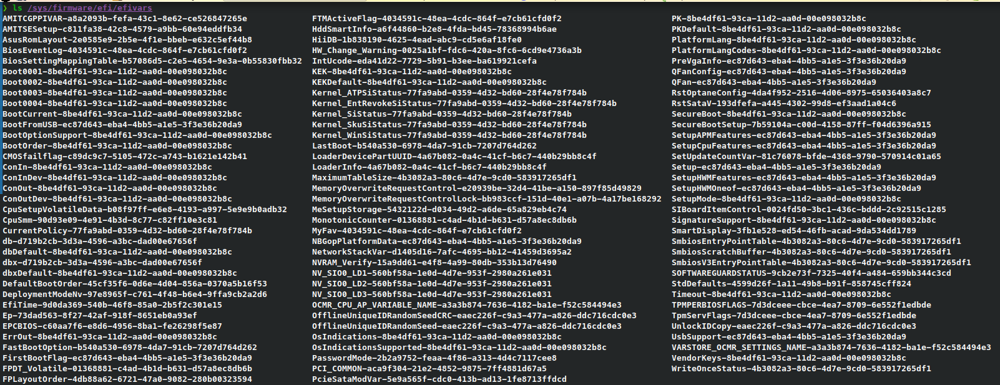

# 3. Comprobamos el tipo de arranque de la placa

```bash
ls /sys/firmware/efi/efivars
```



!!! success "Arranque UEFI"
    Si el comando devuelve una lista de ficheros, el sistema arranca en modo **UEFI**.
    Instalaremos el paquete `grub` y, adicionalmente, `efibootmgr`.

!!! info "Arranque BIOS"
    Si el comando da un error o no devuelve nada, el sistema usa arranque **BIOS** (legacy).
    Instalaremos únicamente el paquete `grub`.
