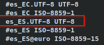

# 9. Localización

Editamos el fichero `/etc/locale.gen`:

```bash
nano /etc/locale.gen
```

Descomentamos la línea que contenga `es_ES.UTF-8 UTF-8`:



Guardamos y ejecutamos:

```bash
locale-gen
```

## Establecer el idioma por defecto

```bash
echo 'LANG=es_ES.UTF-8' > /etc/locale.conf
echo 'KEYMAP=es' > /etc/vconsole.conf
```
